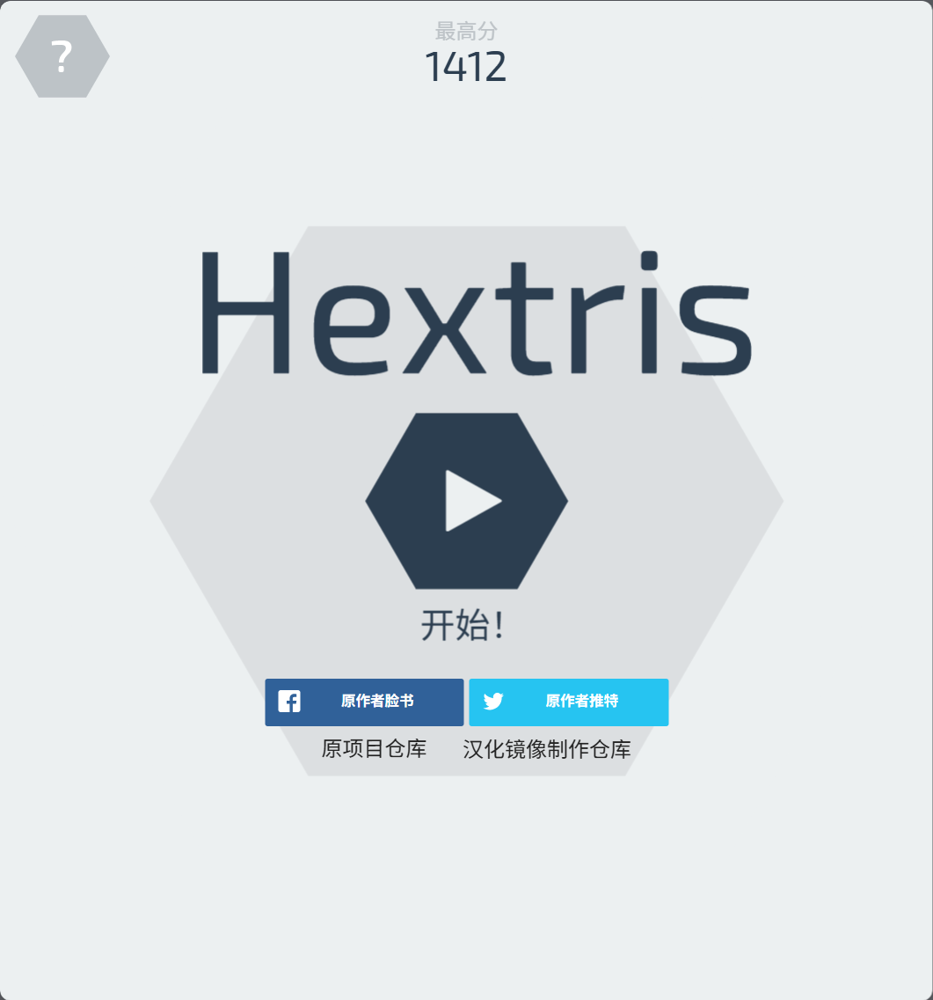
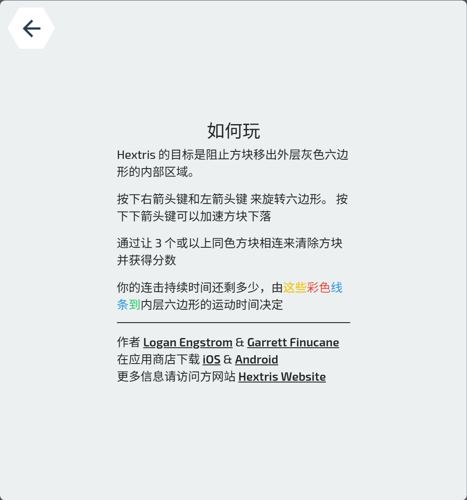
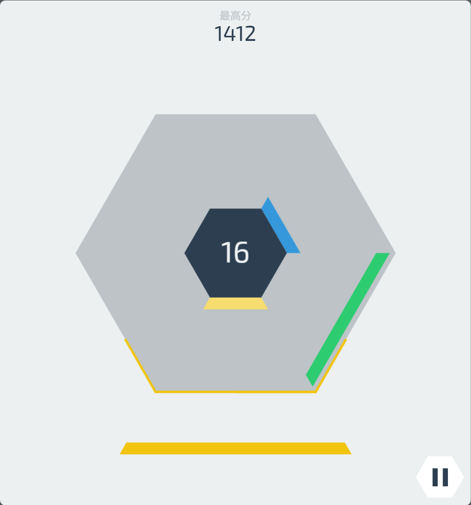

Hextris
==========

<br>

An addictive puzzle game inspired by Tetris. Play it at [www.hextris.io](http://www.hextris.io), or [https://hextris.github.io/hextris](https://hextris.github.io/hextris).  
一款受俄罗斯方块启发的上瘾益智游戏。在 [www.hextris.io](http://www.hextris.io) 或 [https://hextris.github.io/hextris](https://hextris.github.io/hextris) 上玩。

By:  
作者:
 - Logan Engstrom ([@lengstrom](http://loganengstrom.com/))
 - Garrett Finucane ([@garrettdreyfus](http://github.com/garrettdreyfus))
 - Noah Moroze ([@nmoroze](http://github.com/nmoroze))
 - Michael Yang ([@themichaelyang](http://github.com/themichaelyang))
 
## 部署说明

当前汉化仅适用于 版本：

首先感谢原作者的开源。[原项目地址](https://github.com/Hextris/hextris)

具体汉化了那些内容，请参考[翻译说明](./翻译说明.md)。

我看不懂代码，所以只做汉化，有问题，请到原作者仓库处反馈。

本人提供这个项目在 NAS、服务器等的有偿远程部署服务，有需要可联系。  
微信号 `E-0_0-`  
闲鱼搜索用户 `明月人间`  
或者邮箱 `firfe163@163.com`  
如果这个项目有帮到你。欢迎start。

有其他的项目的汉化需求，欢迎提issue。或其他方式联系通知。

### 镜像

从阿里云或华为云镜像仓库拉取镜像，注意填写镜像标签，镜像仓库中没有`latest`标签

容器内部端口 3000 

```bash
docker pull swr.cn-north-4.myhuaweicloud.com/firfe/hextris:2022.02.09
```

### docker run 命令部署

```bash
docker run -d \
--name hextris \
--network bridge \
--restart always \
--log-opt max-size=1m \
--log-opt max-file=3 \
-p 3000:3000 \
swr.cn-north-4.myhuaweicloud.com/firfe/hextris:2022.02.09
```
### compose 文件部署 👍推荐

```yaml
#version: '3.9'
services:
  hextris:
    container_name: hextris
    image: swr.cn-north-4.myhuaweicloud.com/firfe/hextris:2022.02.09
    network_mode: bridge
    restart: always
    logging:
      options:
        max-size: 1m
        max-file: '3'
    ports:
      - 3000:3000
```

## 修改说明

这里对除了汉化之外的代码修改的说明。  
增加修改部分具体见 [修改说明](./修改说明.md)。

`./README.md` 文件翻译，增加 `## 部署说明`、`## 修改说明`、`## 效果截图` 部分。

增加目录 `./图片`
新增文件 `./.dockerignore`、`./Dockerfile`、`./翻译说明.md`、`./修改说明.md`

## 效果截图

| | | | |
|-|- |- |- |


## Citation 引用说明
Did you use Hextris in your research? Cite us as follows:  
如果你在研究中使用了 Hextris，请引用我们如下：
```
  @misc{engstrom2015hextris,
    author = {Logan Engstrom, Garrett Finucane, Noah Moroze, Michael Yang},
    title = {hextris},
    year = {2015},
    howpublished = {\url{https://github.com/hextris/hextris/}},
    note = {commit xxxxxxx}
  }
```


# Contributions 贡献指南
This project is not very actively maintained, as we are all very busy these days. But feel free to open an issue or PR, and we'll eventually take a look.  
由于我们都非常忙碌，这个项目目前并没有被积极维护。但欢迎你随时提交 issue 或 pull request，我们会抽空查看。

# About 关于
Hextris was created by a group of high school friends in 2014.  
Hextris 由一群高中好友于 2014 年创建。

## Press kit 媒体资料包
http://hextris.github.io/presskit/info.html

## License 许可证
Copyright (C) 2018 Logan Engstrom  
版权所有 (C) 2018 Logan Engstrom

This program is free software: you can redistribute it and/or modify
it under the terms of the GNU General Public License as published by
the Free Software Foundation, either version 3 of the License, or
(at your option) any later version.  
本程序是自由软件：你可以根据自由软件基金会发布的 GNU 通用公共许可证（版本 3 或更高）对其进行再分发和修改。

This program is distributed in the hope that it will be useful,
but WITHOUT ANY WARRANTY; without even the implied warranty of
MERCHANTABILITY or FITNESS FOR A PARTICULAR PURPOSE.  See the
GNU General Public License for more details.  
本程序旨在提供实用性，但**没有任何担保**；甚至不包含对特定用途的适销性或适用性的暗示保证。详情请参阅 GNU 通用公共许可证。

You should have received a copy of the GNU General Public License
along with this program.  If not, see <https://www.gnu.org/licenses/>.  
你应该已经收到一份 GNU 通用公共许可证的副本。如果没有，请访问 https://www.gnu.org/licenses/。
